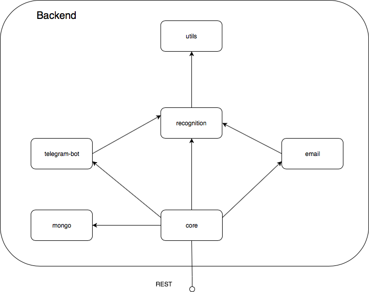
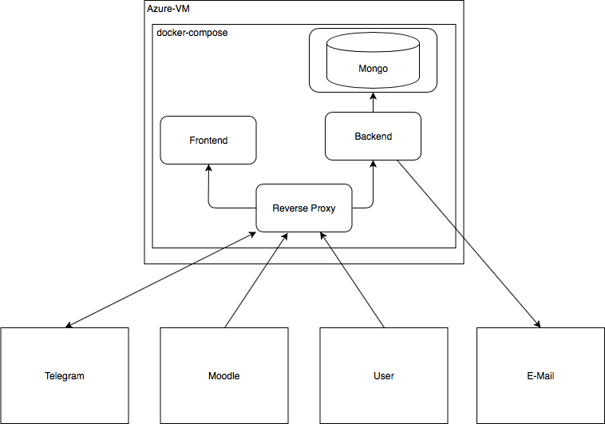

# EFP_Projekt - Chat Bot

---

## Anforderungen

__Allgemein (Projekt)__

- [x] muss bei der Abschlusspräsentation am 25.06. von mindestens einem Gruppenmitglied demonstriert werden.

__Nichtfunktional__

- [x] Muss in Clojure programmiert sein.
- [x] Muss per REST angesprochen werden können.
- [x] Muss mindestens drei verschiedene Design Patterns für funktionale Programmierung verwenden.
- [ ] Soll eine generische Lösung darstellen (Email): Termine und Inhalt der Email-Nachricht soll konfigurierbar sein.

__Funktional__

- [x] Muss für jeden eingeschriebenen Nutzer eines Moodle-Kurses einen Zustand verwalten.
- [x] Soll ein Web-Frontend haben, das ohne Moodle verwendbar ist.
- [x] Soll im verwalteten Zustand eines Moodle-Kurs-Nutzers den Stand des Kommunikationsablaufes repräsentieren.
- [x] Muss eine [Frage](https://jonathan.sv.hs-mannheim.de/mediawiki/index.php/Praxissemester_FAQ) zum Praxissemester beantworten können. Die Erkennung der Frage muss dabei flexibel sein.
- [x] Soll jeweils drei andere weitere Fragen zum Praxissemester flexibel erkennen und beantworten können (mehrfach möglich).
- [x] Muss eine Kommunikationsschnittstelle für Chats (bspw. IRC, Facebook) oder E-Mail unterstützen.
- [ ] Soll zu mindestens drei vordefinierten Zeitpunkten im Semester von sich aus per E-Mail Nachrichten an die eingeschriebenen Nutzern eines Moodle-Kurses versenden und z.B. auf Fristen hinweisen.

__Dokumentation__

- [x] Muss bis 13.07. (COB) dokumentiert und im Quellcode abgegeben sein.
- [x] Muss über Moodle als PDF oder als Link auf ein PDF oder Markdown-Dokument in github oder vergleichbar abgegeben werden.
- [x] Muss die Schnittstelle des Micro-Service spezifizieren.
- [x] Soll den Aufbau des Micro-Service erläutern und die verwendeten Design Patterns für funktionale Programmierung aufzeigen.
- [x] Soll den Mechanismus, mit dem der entwickelte Micro-Service Benutzereingaben klassifiziert, beschreiben.

---

## Deployment-Anleitung

Damit alles ausgeführt werden kann, mussen zusätzlich folgendes (global) auf dem Ziel-Rechner installiert sein:

- Docker
- Docker Compose (bei Mac schon in Docker enthalten, bei Linux extra installieren)
- node.js

Danach können zu Starten folgende Skripte verwendet werden:

1. `init.sh` ausführen
2. `build.sh`ausführen
3. `up.sh` ausführen

Muss in einen Container eingeriffen werden, kann man `docker exec -ti <extenden-container-name> sh` nutzen. Dies öffnet eine `sh`-Konsole im Container.

Der Mongo-Container (mit der Mongo-Datenbank `efp` mit Collection `request`, die den Nachrichten-Verlauf (Zustand) der eingeschriebenen Nutzer speichert) kann mit geeigneten Programmen über Port `27018` erreicht werden (es gibt kein Passwort).

__Build-Skripte__

Diese Skripte dienen der Bequemlichkeit, um nicht immer den langen ```docker-compose```-Befehl eintippen zu müssen.

```
build.sh // generiert für das Back- und Frontend nach Änderungen neue Images

build-backend.sh // generiert ein neues Backend Image

build-frontend.sh // generiert ein neues Frontend Image

init.sh // Generiert das reverse-proxy Image. Dies ist nicht in build.sh erhalten, da das Image nur einmal erzeugt werden muss und daran keine Änderungen nötig sein sollten.
```

__Docker-Skripte__

Das System wird mittels `docker-compose` orchestriert. In `efp-yaml` werden die vier Microservices definiert. Falls der Port `80/443` auf dem Host schon vergeben ist, kann man ihn dort ändern.

```
down.sh // stoppt die Mircoservices und entfernt die Container

logs.sh // zeigt den Inhalt der  Standardausgabe der Container an

stop.sh // stoppt die Container

up.sh // startet alle Container

update.sh // stoppt und Entfernt die bestehenden Container und Startet die aktualisierten Images

logs/stop/up 
./<script>.sh <container-name> // Die Skripte können auch für einen einzelnen Container benutzt werden.
```

## DevOps

Das System besteht aus vier `docker`-Container, die mittels `docker-compose` orchestiert werden.
Das System besteht aus einem Backendserver, der die Grundlagen der Intenterkennung liefert.
Daneben existiert ein Frontend, um das System benutzbar zu machen.
Aus Sicherheistgründen wurden dem Front- und Backend ein Reverse Proxy vorgeschaltet. 
Die Nutzerdaten werden in `mongoDB` gespeichert. Die Daten werden durch ein Volume auf der Hostfestplatte gespeichert.


__Reverse Proxy__

Der Proxy nimmt alle von außen an docker geleitete Requests an und leitet diese entsprechend des Pfades an die entsprechenden Mircoservices weiter.
Durch den Einsatz des Proxys muss nur ein Port für das Projekt geöffnet sein.
Des Weiteren kann nun im Frontend die Hostangabe für das Backend entfallen.
Darüber hinaus könnte man ihn zur Lastenverteilung einsetzen.

Alle Requests, die mit `<host>:<port>/api/` anfangen, werden an das Backend weitergeleitet, der Rest an das Frontend gesendet.
Der Mircoservice nutzt `nginx` als Server.

__Frontend__

Das Frontend nimmt alle auf Port 80 ankommenden Requests entgegen und liefert die ensprechende Response zurück.
Der Mircoservice nutzt `nginx` als Server.
Alle Frontend Requests werden über `/api/...` an das Backend gesendet. 

__Backend__

Das Backend nutzt einen `jetty` Server für Clojure und den Port 5000.

---

## Architektur

Der Chat-Bot unterteilt sich in zwei Hauptkomponenten; Frontend und Backend.

### Backend

Bausteinsicht - Komponenten des Backends

<p align="center">

</p>

__Eingesetzte Pattern__

1. Chain of Operations

Beispielsweise in der Komponente "recognition" wird Chain of Operations verwendet, um unnötige Variablen zu vermeiden.

```Clojure
; BSP:

(defn answer-from-intent
  "Converts an existing intent into the corresponding faq answer."
  [ intent ]
  (->> questions
       (filter (fn [ question ] (= (:intent question) intent)))
       (first)
       (get-answer)))
```

2. Function Builder

Unter Anderem in den Komponenten "recognition" und "utils" wird das Function Builder Pattern verwendet, um von der Thread-First auf die Thread-Last-Schreibweise zu wechseln und um die Lesbarkeit und Wartbarkeit zu verbessern. 

```Clojure
; BSP:

(defn get-thread-last
  "Use this version if you need to use the first-thread macro inside the last-thread macro."
  [ _key ]
  (fn [ _map ]
    (get _map (keyword _key))))
```

3. Map, Filter, Reduce

In der Kompnente Recognition werden alle drei Higher-Order-Functions verwendet, unter Anderem um die Filterungsstufen der Intenterkennung zu realisieren (siehe Intenterkennung).

### Frontend

Bausteinsicht - Komponenten des Frontends

<p align="center">

</p>

Das Frontend ist in Elm, einer an Haskell orientierten funktionalen Programmiersprache implementiert.
Elm wird durch einen Compiler zu JavaScript transpiliert.

__Eingesetzte Pattern__

1. Chain of Operations

    Das `Elm`-Äquivalent zum `Clojure` Threading-Makro `->>` ist `|>`.
    Als Beispiel ist die Funktion `fetchChatbotRequest` zu nenen:

```Elm
-- BSP:

    	fetchChatbotMessage : String -> String -> Time.Time -> Cmd Msg
    	fetchChatbotMessage userId userMessage timestamp =
        	Http.post
            	"/api/query"
            	(Http.jsonBody (encodeUserChatMessageToJson userMessage userId timestamp))
            	chatbotMessageDecoder
                	|> RemoteData.sendRequest
                	|> Cmd.map FetchChatbotMessage
``` 

2. Domain Specific Language

    `Elm` abstrahiert den `DOM` und `HTML`.
    Alle `DOM`-Zugriffe werden von `Elm` erledigt.
    Das Layout wird mittels des `Html`-Moduls erzeugt.
    Siehe die `view`-Funktion.
    
```Elm
-- BSP:

       view : Model -> Html Msg
       view { messages, input } =
           Html.div [ Html.Attributes.class "chatbot-chat-outer-container" ]
               [ Html.div [ Html.Attributes.class "chatbot-chat-header-container" ]
                   [ Html.text "Praxissemster F.A.Q. Chatbot" ]
               , Html.div [ Html.Attributes.class "chatbot-chat-container", Html.Attributes.id "chatbot-chat-container" ]
                   (messages
                       |> List.map viewChatMessage
                   )
                   |> Html.map never
               , Html.div [ Html.Attributes.class "chatbot-chat-input-container" ]
                   [ Html.input [ onEnter UserMessage, Html.Events.onInput InputAdd, Html.Attributes.value input, Html.Attributes.class "chatbot-chat-input" ] [] ]
               ]
```

3. Map, Filter & Reduce

    Die Operationen sind in Elm von jedem Datentyp/Module selbst implementiert.
    Die reduce heißt in Elm foldl.
    
```Elm
-- BSP:

       linkTextCombined =
           textElements
               |> List.indexedMap (,)
               |> List.foldl (\( index, textElement ) combinedElements -> (Maybe.withDefault (Html.br [] []) (Array.get index linkElements)) :: textElement :: combinedElements) []
               |> List.reverse
```

### REST Schnittstelle

Das REST Interface ist von Dialogflow inspiriert. Als Resource steht `api/query` zur Verfügung.

__Request__

- Resource: Query
- Body: 
```
	{ 
		userId: String, 
		userChatMessage: String,
		timeStamp: Number 
	}
```

__Response__

- Resource: Query
- StatusCode: HTTP-Status-Code
- Body: 
```JSON
	{ 
		"statusCode": 200, 
		"userId": "String", 
		"userChatMessage": "String", 
		"botChatMessage": "String", 
		"intentName": "String", 
		"timeStamp": 157328931.0 
	}
```
	
Als Schnittstelle für das Abholden des Nutzer-Chat-Verlaufs steht `api/chat` bereit.

__Request__

Als URL-encoded HTTP-Request

- Query-Parameter: userId

```
// BSP:

api/chat?userId=1234567689
```

__Response__

- StatusCode: HTTP-Status-Code
- Body:
    ```JSON
    [{
      "userId": "String", 
      "userChatMessage": "String",
      "answer": "String",
      "intentName": "String",
      "timeStamp": 157328931.0 
    }]
    ```

Wird für die User ID kein Verlauf gefunden, so wird ein leeres Array zurückgesendet, da der Nutzer neu ist (oder nicht existiert) und somit einen leeren Verlauf hat.

---

## Intenterkennung

Alle Praxissemsterfragen sind in der JSON-Datei `backend/resources/questions.json` abgelegt. Jeder Frage ist ein eindeutiger Intent zugeordnet. Für jede Fragen können mehrere Varianten angegeben werden. Neue Fragen können wie folgt hinzugefügt werden:

1. Ein neues Objekt im JSON-Array hinzufügen, mit folgenden Attributen:
	- `questions`: [String] -> Variable Fragestellungen/Verschiedene Versionen der Frage, liegen linguistisch möglichst weit auseinander für bestmögliche Erkennung
	- `intent`: String -> Eindeutiger Identifikator der Fragestellung
	- `answer`: String -> Antwort die das System für diesen Intent zurückgibt
2. `buildBackend.sh` ausführen
3. `update.sh` ausführen

Wenn das Backend gestartet wird, werden die Fragen geladen und anschließend wie jede ankommende Nutzerfrage bearbeitet (`prepare-sentence`):

__Input__ 

Chat-Nachricht des Benutzers als String

__Output__ 

Chat-Nachricht des Bots als String

__Ablauf__

0. Rechtschreibüberprüfung (optional) mit dem [Norvig Spelling Corrector](https://en.wikibooks.org/wiki/Clojure_Programming/Examples/Norvig_Spelling_Corrector) __[optional, wird nicht verwendet]__

1. Alle Satz- und Sonderzeichen werden entfernt (`remove-punctuation`)

2. Alle unnötigen Wörter (`stop words`) werden entfernt (`remove-stop-words`). Alle in diesem Schritt entfernten Wörter tragen nichts zum Erkennen der Frage bei. Dies sind unter anderem der, die, das, ist, dessen (siehe `backend/resources/stop-words.json`).

3. Alle Wörter werden auf ihren Grundtyp abgebildet (`stem-sentence`) mit dem [Snowball Stemmer](https://clojars.org/snowball-stemmer). Um alle Fragen grammatikalisch anzugleichen und ähnliche Wörter auf den Grundtyp abzubilden, wird ein Stemming genannter Vorgang ausgeführt. Während des Stemmings werden die Wordenden heuristisch abgeschnitten.

4. Nachdem die Nutzeranfrage auch bearbeitet wurde, wird mit allen Chatbot-Fragen die Kosinus-Ähnlichkeit ([Cosine-Similarity](https://github.com/WojciechKarpiel/cosine-similarity/blob/master/core.clj)) errechnet und anschließend die Frage mit dem höchsten Wert zurückgeliefert.

> __Anmerkung__ Mit der Cosine-Similarity ohne Rechtschreibprüfung und mehreren Fragen getestet. Es funktioniert überraschend gut.
Es sollte ausreichen wenn wir mehrere Versionen der Frage und eine Rechtschreibüberprüfung haben.

---

## Telegram Bot

__Beschreibung__

Beim Erstellen eines Telegram-Bots, wird dieser Bot Eigentum des Telegram Kontos, über den der Bot erstellt wurde. Nur dieses Konto kann Änderungen am Bot vornehmen, mithilfe eines Chats mit dem Telegram-Bot `Botfather`. Dieser Ablauf kann nicht verändert werden. Es kann jedoch einfach ein neuer Bot erstellt werden und der Token im Quellcode verändert werden, damit dieser funktioniert. Mehr Informationen sind in der [Beschreibung der Telegram Bot API](https://core.telegram.org/bots/api) verfügbar.

- __Bot User Name:__ HSMAPraxisSemesterBot
- __URL:__ https://t.me/HSMAPraxisSemesterBot
- __Token:__ `619166619:AAETbQdzarQiXd9yKUlmhs3zlVmzTceHPJU`

__Chat-Nachricht vom Bot erhalten/zum Bot schicken__

Für die Kommunikation des Chatbots mit Telegram wird das Clojar [Morse](https://clojars.org/morse) eingesetzt. Die in der Architektur beschriebene Backend-Komponente "telegram-bot" (`backend/src/telegram_bot.clj`) nutzt die von [Morse](https://clojars.org/morse) angebotenen Methoden, um die Kommunikation mit Telegram zu übernehmen und die eingehenden Fragen zu verwerten.

Von Telegram werden Nachrichten mit REST per POST Request als JSON übermittelt. Dazu muss der Chatbot zunächst einen Webhook für Telegram setzen. Dies geschieht... . Das JSON ist wie folgt aufgebaut:

```JSON
{
	"update_id": 96255488,
	"message": 
	{
		"message_id": 17,
		"from": 
		{
			"id": 591870787,
			"is_bot": false,
			"first_name": "SomeFirstName",
			"last_name": "SomeLastName",
			"username": "someusername",
			"language_code": "de-DE"
		},
		"chat": 
		{
			"id": 591870787,
			"first_name": "SomeFirstName",
			"last_name": "SomeLastName",
			"username": "someusername",
			"type": "private"
		},
			"date": 1529655950,
			"text": "some chat message",
			"entities": 
				[{
					"offset": 0, 
					"length": 5, 
					"type": "bot_command"
				}]
	}
}
```

[Morse](https://clojars.org/morse) stellt Methoden zum senden von Antworten an Telegram-Chat-Instanz. An diese kann ein String mit der Antwort übergeben werden.

---

## Email Service

__Beschreibung__

__Konfiguration von termingesteuerten Mails__

---